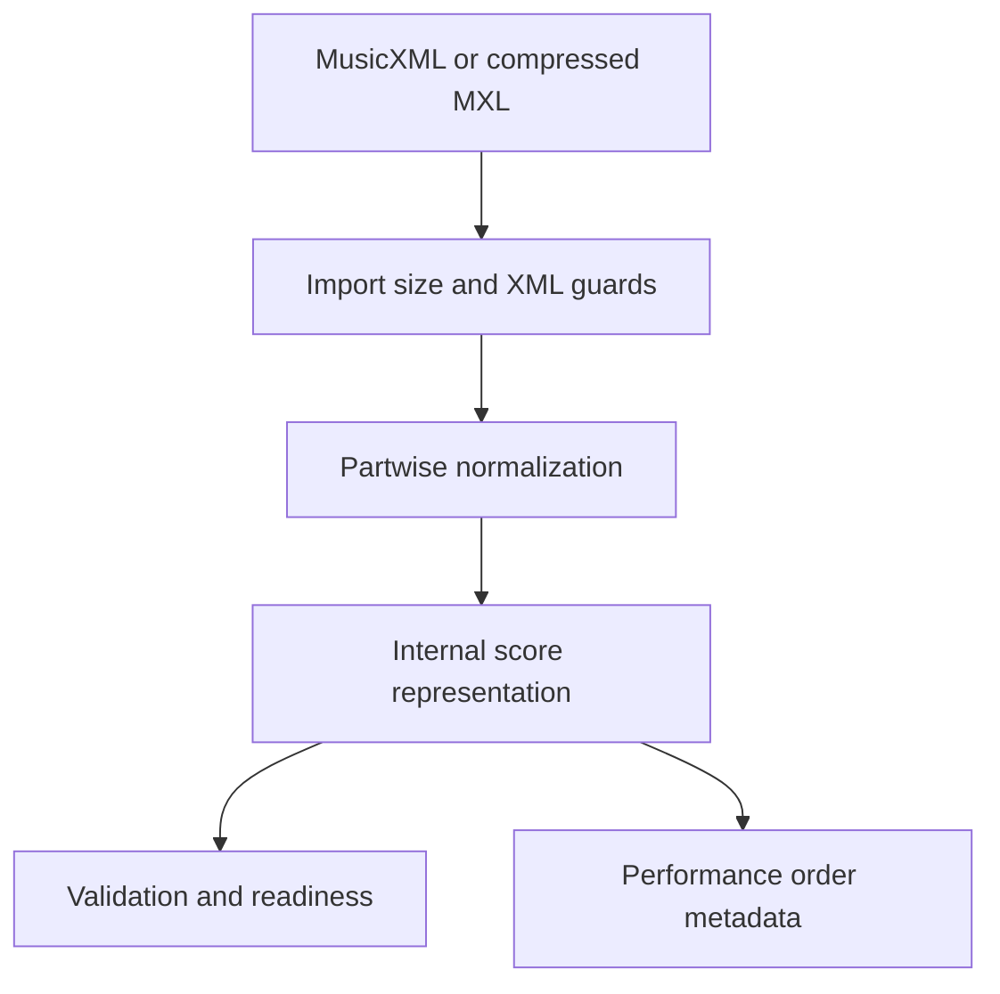

# CoroVoz Score Engine

A real MusicXML import and score-normalization engine extracted from CoroVoz, with original synthetic SATB fixtures.

A score file can parse as XML while still having incomplete measures, ambiguous voices or unsupported notation. This package makes that distinction visible before downstream playback or rehearsal features consume the score.



## What is real

Five original JavaScript modules implement import, parsing, normalization, score validation and notation capability/audit metadata. The internal model represents parts, measures, voices, notes/rests, timing and performance order. The supplied fixture has four synthetic parts named Soprano, Alto, Tenor and Bass; SATB is example organization, not an automatic vocal-range classifier.

The Node harness provides a DOM parser so the same parser can run outside the application. The example is an original one-measure sustained chord; it contains no lyrics, recording or licensed composition.

## Run

Requires Node.js 24 or later and npm. Dependency versions and integrity values are locked.

```sh
git clone https://github.com/walteryanko/corovoz-score-engine.git
cd corovoz-score-engine
npm ci --ignore-scripts
npm test
npm run demo
```

The demo reads `examples/synthetic-satb.musicxml`, invokes the real parser and prints the four parts, validation and performance order. It is a CLI demonstration of the engine, not a mocked interface.

## Tested

Eleven tests cover SATB parsing, independently specified MIDI pitches and durations, simultaneous voices via backup, short-measure review, complementary pickup handling, repeats/performance order, timewise normalization, unknown/duplicate/missing parts, DTD/entity rejection, malformed/deep XML and compressed MXL import.

## Limits

This is a supported subset of MusicXML, not a complete standards-conformance claim. Readiness warnings require human review. Performance-order metadata is not neural singing, audio playback or sample-accurate scheduling. Browser UI behavior was not retested in this excerpt. There is no OMR, voice model, voicebank, music recording or commercial Neural Voice layer.

Import guards bound file/container/XML sizes, depth and element counts; they do not establish that every malicious compressed input is harmless. Use isolation and resource limits for untrusted public uploads.

[Dependency inventory](docs/DEPENDENCIES.md) · [Provenance](docs/PROVENANCE.md)

## License and product boundary

CoroVoz Score Engine is a public open-core excerpt for MusicXML/MXL parsing, normalization, validation and internal score representation. The complete CoroVoz application is a separate proprietary product.

MPL-2.0 applies to the selected first-party engine, original synthetic fixtures, tests and accompanying original documentation. It does not license the private application, Neural Voice Engine, voicebanks, trained vocal models, private datasets, user uploads or cloud infrastructure.

See [LICENSE](LICENSE) for the unmodified MPL-2.0 text and [LICENSE_SCOPE.md](LICENSE_SCOPE.md) for scope and branding. `private: true` prevents accidental publication to the npm registry; it does not restrict the public repository's license.

## Continuous verification

The [Verify workflow](.github/workflows/verify.yml) runs the real tests and CLI demo on Node 24 after a locked dependency installation. See [GitHub Actions](https://github.com/walteryanko/corovoz-score-engine/actions) for current run results. No separate lint or static typecheck is configured. Historical local test results describe this excerpt only.
